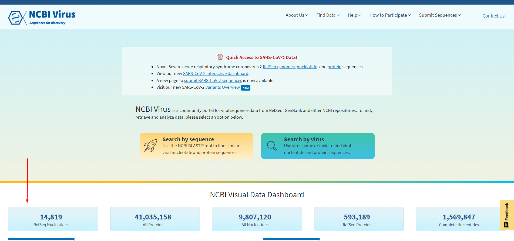
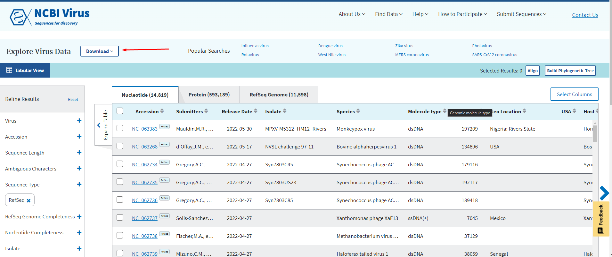
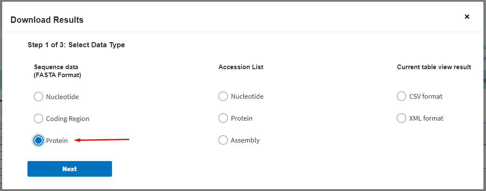
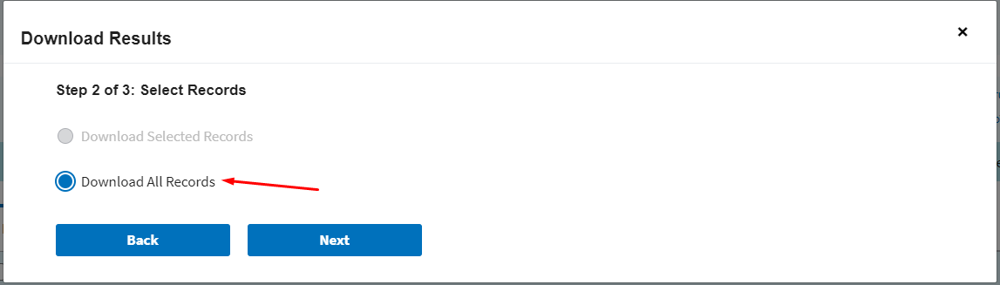
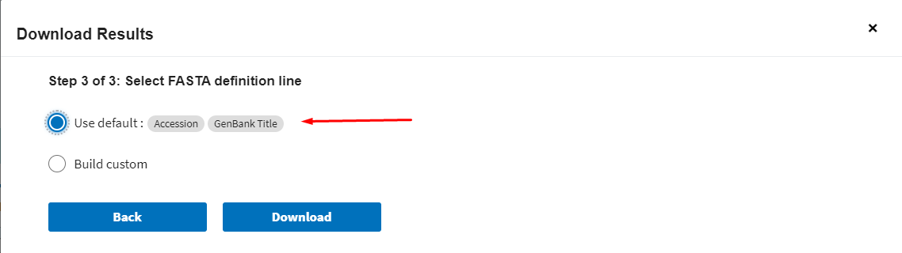
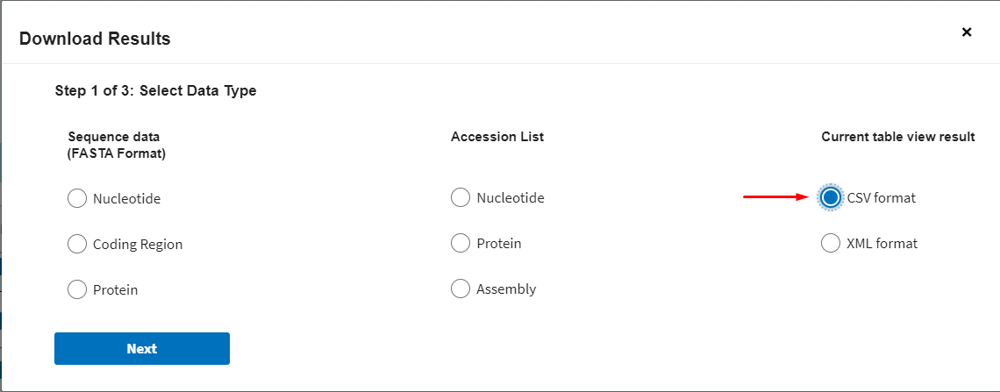
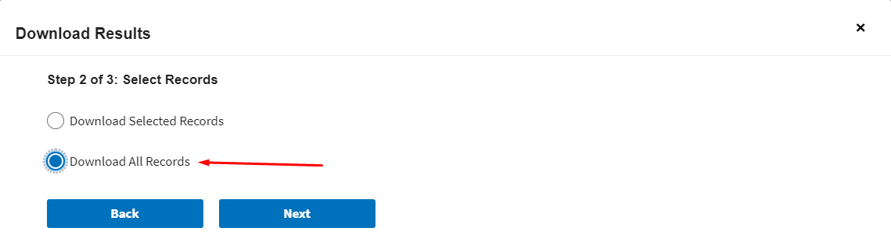
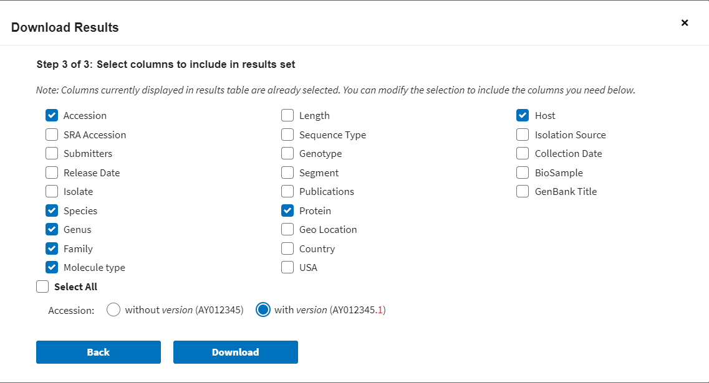
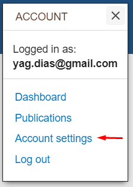

# EEfinder
## Endogenous Element Finder, Alpha dev version

### Dependencies:
|Name|Version|
| ------ | ----- |
_libgcc_mutex|**0.1**
_openmp_mutex|**4.5**
bedtools|**2.27.1**
bio|**1.3.8**
biopython|**1.79**
biothings-client|**0.2.6**
blast|**2.5.0**
boost|**1.73.0**
bzip2|**1.0.8**
ca-certificates|**2022.3.29**
certifi|**2021.10.8**
charset-normalizer|**2.0.12**
icu|**58.2**
idna|**3.3**
ld_impl_linux-64|**2.35.1**
libboost|**1.73.0**
libffi|**3.3**
libgcc-ng|**9.3.0**
libgomp|**9.3.0**
libstdcxx-ng|**9.3.0**
lz4-c|**1.9.3**
mygene|**3.2.2**
ncurses|**6.3**
numpy|**1.22.3**
openssl|**1.1.1n**
pandas|**1.4.2**
pip|**21.2.4**
py-boost|**1.73.0**
python|**3.9.12**
python-dateutil|**2.8.2**
pytz|**2022.1**
readline**|8.1.2**
requests|**2.27.1**
setuptools|**61.2.0**
six|**1.16.0**
sqlite|**3.38.2**
tk|**8.6.11**
tqdm|**4.64.0**
tzdata|**2022a**
urllib3|**1.26.9**
wheel|**0.37.1**
xz|**5.2.5**
zlib|**1.2.11**
zstd|**1.4.9**

#### Install dependencies with conda enviroment:

`conda env create -f env.yml`
`conda activate env`

For users that want to use diamond:
> https://github.com/bbuchfink/diamond/releases/tag/v2.0.15

### Running:
#### Test files:
There are some test files in the folder `test_data_dev`:
Name|Usage
| --- | --- |
fasta_genome|Ae_aeg_Aag2_ctg_1913.fasta
virus_proteins_table|virus_subset2.csv
virus_db|virus_subset.fa
host_protein_db|filter_subset.fa
TE_protein_db|TEs_subset.fa
#### Test line:
`python EEfinder.py -in Ae_aeg_Aag2_ctg_1913.fasta -mt virus_subset2.csv -db virus_subset.fa -db2 filter_subset.fa -db3 TEs_subset.fa -od <outdir>`

#### Default line:
`python EEfinder.py -in <fasta_genome> -mt <virus_proteins_table> -db <virus_db> -db2 <host_protein_db> -db3 <TE_protein_db> -od <protein_table>`
#### Default line (DIAMOND):
You can choose which mode of DIAMOND you want to use between:
- fast
- mid-sensitive
- sensitive
- more-sensitive
- very-sensitive
- ultra-sensitive
Using 'fast' mode as example:
`python EEfinder.py -in <fasta_genome> -mt <virus_proteins_table> -db <virus_db> -db2 <host_protein_db> -db3 <TE_protein_db> -od <protein_table> -md fast`
#### Keeping temporaries:
For not deleting temporaries after conclusion use the argument: `-rm --remove False`
#### Merge level:
For decide which philogetic level is going to be use, between family or genus, use the argument: `-ml --merge_level`
#### Modify min lenght of contigs:
In EEfinder you can choose the minimum lenght of contigs that BLAST/DIAMOND is going to use with the argument: `-ln --lenght`
#### Modify flank lenght:
You can choose the lenght of flanking regions going to be extracted with the argument: `-fl --flank`
#### Modify merge lenght:
There are the possibility to change the lenght for merging elements in EEfinder: `-lm --limit`
#### Name your prefix:
You can name the prefix that EEfinder is going to use to create your output files with: `-pr --prefix`
We suggest to use the name of the genome with the name of the assembly like: **Ae_aeg_Aag2 for Aedes _aegypti_/Aag2**

### Adquire datasets
#### Protein database
For getting the **protein database** you can go on [ncbi virus](https://www.ncbi.nlm.nih.gov/labs/virus/vssi/#/) and follow this steps:

Scroll down and select RefSeq

Click on download button

Select protein

Select Download all records

Select default
#### Protein table
For getting the protein csv file continue on the RefSeq page and also click on the download button and follow this steps:

Select csv

Select Download all records

#### For bacterias
For bacterias you can use the addicional script **bac_retriever**, on the folder **accessory_scripts/**, that create the table with the proteins you choose.
It require only 3 arguments, your proteins `-in --input`, an email for Entrez `-em --email` and an API key for ncbi `-key --APIkey`.
##### Email and APIkey
You have to register on NCBI and create an APIkey, for the APIkey go on **Account Settings** and find **API Key Management** to create your APIkey

#### Filter Datasets

