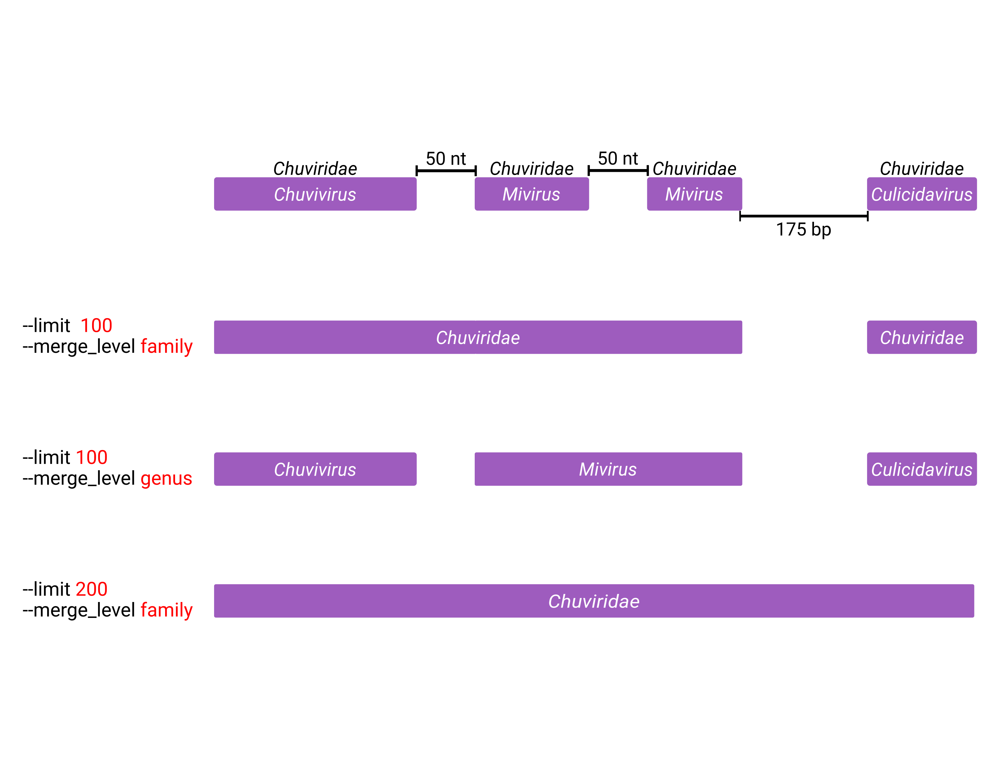
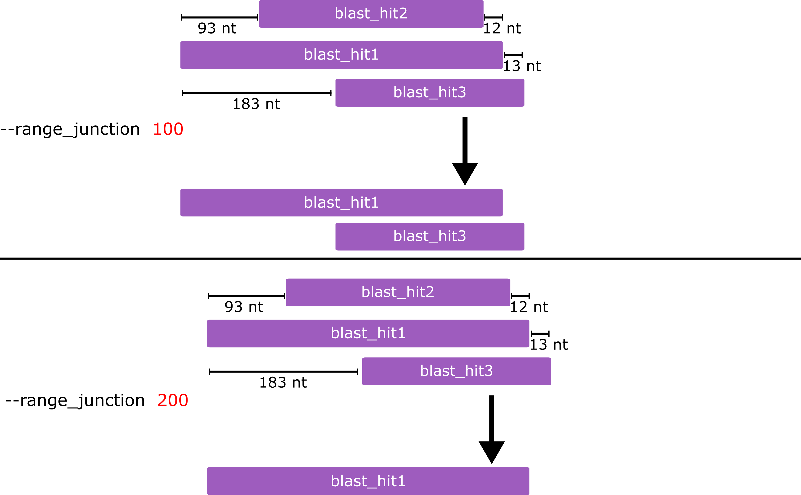

# Custom arguments

This page collects the tuning arguments that shape how EEfinder merges and
filters elements, with worked examples.

## Keeping temporary files

By default EEfinder archives its intermediate files under `tmp_files/` inside the
output directory. Pass `-rm`/`--removetmp` to delete them after a successful run
instead.

## Merging fragmented elements

Endogenous viruses are ancestral integrations, and the endogenised regions
accumulate deletions and insertions over time. As a result a single ancestral
integration can survive as several fragments with slightly different — or
truncated — taxonomic assignments, so the current taxonomic levels may not
reflect the classification of the ancestral virus. Two arguments let you merge
such fragments.

### Merge length (`-lm` / `--limit`)

Adjusts the distance used to merge two or more endogenous elements of the same
taxon (as defined by `--merge_level`) and the same sense within a given range.
A larger value merges neighbouring fragments that a stricter value would keep
apart. It is passed straight to `bedtools merge -d` (default `1`).

### Merge level (`-ml` / `--merge_level`)

Selects the taxonomic level — `genus` (default) or `family` — used to decide
whether two neighbouring elements belong to the "same taxon" for merging.
Merging at `family` is more permissive: fragments assigned to different genera of
one family are joined, which a `genus`-level merge keeps separate.

Elements whose level is unknown are never merged by taxon — they fall back to
being keyed on their own subject accession, so an unclassified fragment is only
ever merged with itself.

(range-junction-arg)=
## Range junction (`-rj` / `--range_junction`)

Sets the range used to clean redundant hits during the similarity analysis. The
filter is applied to the BLAST/DIAMOND results, keyed on the query name, the
start range of the query and the sense, so overlapping hits describing the same
region collapse to the single best-scoring one (default `100`).

Worked example — the three input hits all describe the same region, so EEfinder
keeps only the best-scoring one and records its sense:

**Input**

| qseqid | sseqid | pident | length | mismatch | gapopen | qstart | qend | sstart | send | evalue | bitscore |
| ------ | ------ | ------ | ------ | -------- | ------- | ------ | ---- | ------ | ---- | ------ | -------- |
| aag2_ctg_162 | AAC97621 | 30.636 | 173 | 108 | 3 | 130612 | 130100 | 132 | 294 | 2.43e-08 | 69.7 |
| aag2_ctg_162 | AAU10897 | 23.611 | 216 | 163 | 2 | 130717 | 130073 | 134 | 348 | 2.52e-10 | 75.3 |
| aag2_ctg_162 | AOC55195 | 24.535 | 269 | 197 | 4 | 130864 | 130073 | 84 | 351 | 4.49e-11 | 77.8 |

**Output**

| qseqid | sseqid | pident | length | mismatch | gapopen | qstart | qend | sstart | send | evalue | bitscore | sense |
| ------ | ------ | ------ | ------ | -------- | ------- | ------ | ---- | ------ | ---- | ------ | -------- | ----- |
| aag2_ctg_162 | AOC55195 | 24.535 | 269 | 197 | 4 | 130073 | 130864 | 84 | 351 | 4.49e-11 | 77.8 | neg |

Both AAC97621 and AAU10897 cover the same region as AOC55195, so they are removed
as redundant; the surviving hit's coordinates are re-ordered ascending and its
sense (`neg`) is recorded in a dedicated column.

Alignments shorter than **33 aa** are discarded at the same step, regardless of
`--range_junction`.

## Minimum contig length (`-ln` / `--length`)

Sets the minimum length of contigs passed to BLAST/DIAMOND. Contigs shorter than
this are dropped before the search (default `10000`; lower it for short test
contigs, as in the [example run](running.md#example-run-with-the-bundled-test_files)).

## Flank length (`-fl` / `--flank`)

Sets the length of the flanking regions extracted around each endogenous element
into `PREFIX.EEs.flanks.fa` (default `10000` nt on each side). The extraction
uses `bedtools slop`, so flanks are clipped at contig boundaries rather than
running past them.

## Masking (`-cm` / `--clean_masked` and `-mp` / `--mask_per`)

Endogenous elements frequently sit inside repetitive regions, which many genome
assemblies deliver soft-masked (lower-case). With `-cm`, EEfinder writes an
additional, filtered pair of outputs (`PREFIX.EEs.cleaned.fa` and
`PREFIX.EEs.cleaned.tax.tsv`) containing only the elements whose
lower-case-plus-`N` content is at or below `-mp` percent (default `50`).

The unfiltered `PREFIX.EEs.fa` / `PREFIX.EEs.tax.tsv` are always written too, so
the flag adds a view rather than replacing one. Without `-cm` no masking filter
is applied and `-mp` has no effect.

## Output prefix (`-pr` / `--prefix`)

Names the prefix EEfinder uses for output files and element names. Sequence
headers are formatted as `PREFIX/CONTIG:START-END` (e.g.
`Ae_aeg_Aag2_ctg_1913/ctg_1913:1754-2689`); the taxonomy table's `Element-ID`
column carries the same name without the `PREFIX/` part. We suggest combining
the genome and assembly names, e.g. **Ae_aeg_Aag2** for *Aedes aegypti* / Aag2.

If `-pr` is omitted the prefix is derived from the input filename, up to the
first dot.
