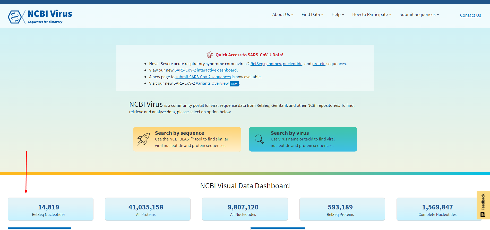
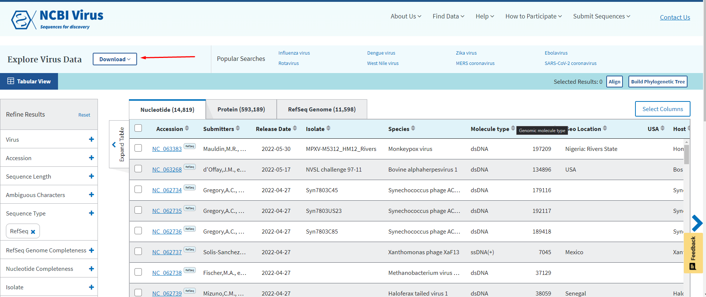
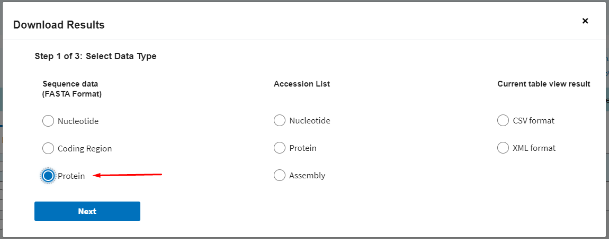
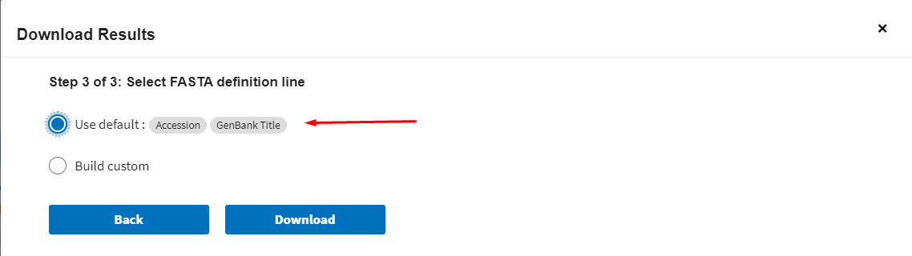
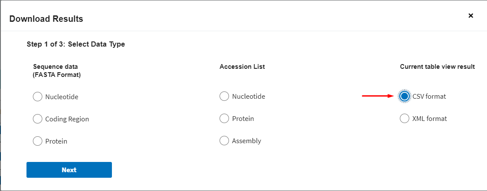
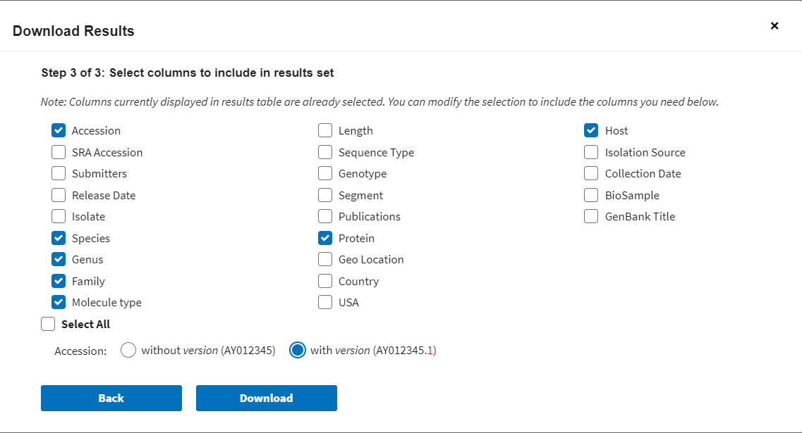
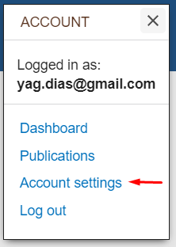

# Acquiring databases (`get-databases`)

`screening` needs three reference inputs:

| Input | CLI flag | Produced by |
|-------|----------|-------------|
| Protein database FASTA | `-db` | `get-databases virus` / `bacteria` |
| Protein metadata CSV | `-mt` | `get-databases virus` / `bacteria` |
| Host-gene bait FASTA | `-bt` | `get-databases host` |

`get-databases` automates the manual NCBI RefSeq downloads (previously done by
hand through the NCBI Virus web UI) using the
[NCBI datasets](https://www.ncbi.nlm.nih.gov/datasets/) CLI. It is a **command
group** with one subcommand per database, because each group has its own
defaults and options.

```{note}
`get-databases` requires the `datasets` binary (`ncbi-datasets-cli`) on `PATH`.
Version **≥ 18.1** is required: earlier builds crash on viral downloads because
NCBI added the "acellular root" taxonomy rank above Viruses (taxid 10239) in
2025. `env.yml` pins **18.36.0**.
```

(databases-define-search)=
## The databases define the search space

These three files are not just inputs — they are what makes the run a search for
one thing rather than another. EEfinder has no built-in reference data and no
notion of which taxa are "interesting": it reports similarity to whatever proteins
you give it, labelled with whatever taxonomy your metadata table carries.

Three consequences are worth stating explicitly:

- **The donor lineage is your choice.** A RefSeq viral protein set screens for
  endogenous viral elements; a bacterial protein set screens for endogenous
  bacterial elements. Nothing in the pipeline is specific to either, so any
  donor lineage whose proteins you can assemble into a FASTA can be screened
  for on the same code path.
- **Scope follows the database.** Restricting `-db` to a single family — or a
  single genus — restricts the whole analysis to it, at a fraction of the
  runtime. Conversely, a hit can only ever be reported for a lineage that is
  represented in the database: absence of an element is evidence of absence
  *from your reference set*, not from the genome.
- **The taxonomy is yours too.** `Family`, `Genus`, `Species`, `Molecule_type`
  and `Host` in the output tables are copied verbatim from `-mt`. EEfinder never
  consults an external taxonomy, so the rank names, spellings and any
  `Unclassified` entries in your results are the ones in your table.

The `-bt` bait set defines the opposite side of the comparison: it is the
background that candidate elements must *fail* to match better than they match
`-db`. It should therefore represent the host's own proteome (see
[Host-gene baits](#host-gene-baits)).

(host-gene-baits)=
## Host-gene baits (`-bt`)

The bait set is a collection of **host proteins** used to discard false
positives: a putative EE that matches a host gene with a higher bitscore than it
matches the viral/bacterial reference is removed (see
[Running the pipeline](screening.md)).

We suggest the RefSeq proteins of the host species, or of the closest available
relative. No metadata table is needed for this input — only the FASTA.
`test_files/filter_subset.fa` shows the expected shape (RefSeq *Aedes
albopictus* proteins used against an *Aedes aegypti* genome).

## Subcommands

```bash
# Viral protein database + metadata (the -db / -mt inputs)
eefinder get-databases virus -tx Flaviviridae -od db/ -pr virus

# Bacterial protein database + metadata
eefinder get-databases bacteria -tx 2 -od db/ -pr bacteria

# Host proteins used as -bt baits (no metadata CSV)
eefinder get-databases host -tx "Aedes aegypti" -od db/ -pr host
```

### Shared options

| Option | Meaning |
|--------|---------|
| `-tx/--taxon` | NCBI taxon name or tax id (e.g. `Flaviviridae`, `10239`). |
| `-od/--outdir` | Output directory. |
| `-pr/--prefix` | Output basename (default: the dataset type → `virus.fa` / `virus.csv`). |
| `--refseq/--all-sequences` | Restrict to RefSeq (default) or fetch everything. |
| `--exclude-taxon` | Leave a branch of the taxonomy out of the download entirely; repeatable. Defaults to SARS-CoV-2 for `virus`. See [Excluding a virus from the download](#excluding-a-virus-from-the-download). |
| `--cluster/--no-cluster` | Collapse 100%-identical / 100%-coverage duplicate proteins with `cd-hit` before writing the database (on by default). |
| `--released-before` | Only include data released on or before this date (`YYYY-MM-DD`), so a build can be reproduced later. |
| `--keep-download` | Keep the downloaded zip and the extracted `*_ncbi/` directory (deleted by default). |
| `--attempts` | How many times to try the download before giving up (default 3). |
| `--stall-timeout` | Seconds without any sign of life after which a download is treated as hung, killed and retried (default 180; `0` waits forever). |
| `--debug` | Verbose logging (resolved arguments, the `datasets` command, sequence tallies). |

`-tx` defaults to `10239` (Viruses) for `virus` and `2` (Bacteria) for
`bacteria`, so `eefinder get-databases virus -od db/` downloads the whole RefSeq
viral protein set. For `host`, `-tx` is **required**.

### Per-subcommand options

`--exclude-uninformative` is accepted by **all three** subcommands (on by
default). `--standardize-proteins` exists only on `virus` and `bacteria`, since
`host` produces the baits FASTA and no metadata CSV to standardise.

## Excluding a virus from the download

SARS-CoV-2 is **9,210,670 of the 15,027,633 viral records in GenBank — 61%** of
everything under taxon `10239`, and 99.2% of *Coronaviridae*. A
`get-databases virus --all-sequences` run therefore spends most of its
bandwidth, disk and clustering time on one virus that is of no interest to an
endogenous-element search.

`--exclude-taxon` leaves it out. It is **not** a post-download filter: the
branch is never requested from NCBI, so nothing about it is transferred.

```bash
# the default: SARS-CoV-2 is left out
eefinder get-databases virus -od db/ --all-sequences

# leave out something else as well (repeatable, tax id or scientific name)
eefinder get-databases virus -od db/ --exclude-taxon 2697049 \
                                     --exclude-taxon "Influenza A virus"

# opt out and download the branch after all
eefinder get-databases virus -od db/ --exclude-taxon none
```

The option is available on `bacteria` and `host` too, where it has no default.

### How it works

The `datasets` CLI has no exclusion flag — its `virus genome taxon` subcommand
can only be told what to *include*. So EEfinder inverts the request. It walks
the lineage from the taxon being downloaded to the taxon being excluded and, at
each step, keeps every child except the one that leads to the exclusion:

```
Viruses (10239)          18 children -> keep 17
  Riboviria                7 children -> keep 6
    Orthornavirae          9 children -> keep 8
      ...
        Sarbecovirus       2 children -> keep 1
          B. pandemicum    2 children -> keep 1   <- SARS-CoV-2 dropped here
```

The union of those siblings is exactly "all viruses except SARS-CoV-2": **63
taxa**, which fit in a single `datasets --inputfile` call (the CLI accepts 100).
Longer lists are split across several downloads and extracted one package per
subdirectory. `--debug` prints the per-rank breakdown, and the run log records
the expansion under `arguments.exclude_taxa`.

The lineage is resolved live rather than hard-coded, which matters: SARS-CoV-2's
parent taxon was recently renamed to *Betacoronavirus pandemicum* by the ICTV.

### The one caveat

Records attached **directly** to a rank on that path — `"Betacoronavirus sp."`
and similar — belong to no child, so this method does not reach them. Measured
against NCBI's own totals that is **273 records out of 5.8 million (0.005%)**,
all of them unclassified entries whose genus and family EEfinder could not have
resolved anyway.

## Progress and interrupted downloads

A whole-RefSeq download takes a long time, so `get-databases` now shows what it
is doing. The `datasets` CLI draws its own transfer progress
(`Downloading: virus.zip  65.5kB 125kB/s`, then `Validating package files`) and
EEfinder passes it straight through instead of swallowing it; the steps EEfinder
performs itself — extracting the archive, merging the `protein.faa` files and
building the metadata table — get their own bars:

```
Downloading: db/virus.zip   1.2GB 8.4MB/s
Validating package files [====================================] 100% 5/5
Extracting         [####################################]  312/312
Merging FASTAs     [####################################]  312/312
Building metadata  [###########-------------------------]  1.2M/4.1M
```

Progress is shown **only on a terminal**: piped into a file or a workflow engine
the redraw sequences would be noise, so the output falls back to being captured
silently. `EEFINDER_NO_PROGRESS=1` turns it off on a terminal too.

```{note}
External commands are run with their **standard input closed**. The NCBI
`datasets` client otherwise finishes its download, prints its completed
validation bar and never exits — the same download takes 3 seconds with stdin
closed and hangs indefinitely with it open, which is what an interactive
terminal provides.
```

### Retries and stalled transfers

NCBI downloads fail in two different ways, and both are handled:

- **an error the tool reports** (`Internal error (invalid zip archive). Please
  try again`) — retried;
- **an HTTP/2 stream reset**
  (`stream error: stream ID 3; INTERNAL_ERROR; received from peer`), which aborts
  large transfers part-way through — the retry is then made over **HTTP/1.1**
  (`GODEBUG=http2client=0`), which completes the same download. Repeating the
  attempt unchanged would only fail the same way;
- **a package that arrives broken**, sometimes with the tool still reporting
  success (`118MB invalid zip archive`) — the archive is verified after every
  download, and a bad one is retried. Any archive already at the destination is
  discarded before the first attempt, so a stale file from an interrupted run is
  never downloaded into;
- **a hang it never reports**, where the connection stays open and nothing more
  arrives — detected and retried. A transfer counts as stalled when *neither* new
  output from `datasets` *nor* growth of the archive is seen for
  `--stall-timeout` seconds (default 180), so a slow-but-working transfer is
  never mistaken for a hung one. The attempt is killed and the partial archive
  discarded before the next try.

While nothing is happening, the wait is announced rather than silent:

```
INFO:eefinder:Still waiting on datasets: no output and no new data for 40s
(giving up and retrying at 180s)
```

so a slow transfer can be told apart from a dead one without guessing. If a run
ever does appear stuck, `kill -USR1 <pid>` makes EEfinder print what every thread
is doing, and `ps -o pid,stat,etime,command -p $(pgrep -f "datasets download")`
shows whether the NCBI client itself is the one waiting.

A completed transfer is never mistaken for a hung one in the other direction
either: the run ends when `datasets` exits, without waiting for its pipe to
close, because a background process the tool leaves behind can hold that pipe
open indefinitely.

`--attempts` (default 3) bounds the retries, with a short growing backoff between
them. Failures that are **permanent** — a misspelled taxon, an unknown flag — are
not retried, since the next attempt would produce the same message:

```
$ eefinder get-databases virus -tx NotARealTaxon -od db/
Failed to download databases: datasets download failed after 1 attempt(s)
(exit 1): Error: The taxonomy name 'NotARealTaxon' is not a recognized virus taxon.
```

## What a run leaves behind

```
db/
├── virus.fa              the protein database (screening -db)
├── virus.csv             its metadata (screening -mt)
├── virus.tracking.tsv    the fate of every downloaded accession
├── virus.clstr           the cd-hit clusters: members and representatives
└── virus.log             the JSON run summary
```

The downloaded zip and the `*_ncbi/` directory it is extracted into are
**deleted** once they have been read: for a whole-RefSeq download they are
several GB duplicating what is already in the outputs. `--keep-download` keeps
them.

A download split by `--exclude-taxon` writes one package per batch
(`virus.part1.zip`, …) with a `virus.partN.taxa.txt` listing the taxa it asked
for, extracted into `virus_ncbi/part_N/`. They are cleaned up on the same terms
as the single-package files.

### `tracking.tsv`

One row per sequence **as downloaded** — including the ones that did not make it
into the database, which appear nowhere else:

| Column | Meaning |
|--------|---------|
| `Accession`, `Species` | the record as NCBI delivered it |
| `Protein_downloaded` | the product name in the FASTA header |
| `Protein_final` | the name after `--standardize-proteins` |
| `Name_changed` | `yes` when standardisation renamed it (`RNA-dependent RNA polymerase` → `RdRp`) |
| `Status` | `kept` or `removed` |
| `Reason` | why it was removed: `released_after_cutoff`, `uninformative_product`, `identical_duplicate`, `product_standardized_to_unknown` |
| `Organism_release_date` | earliest release date among the organism's genome records — recorded for every accession, kept or removed, so a dated build can be checked rather than trusted |
| `Cluster`, `Cluster_representative` | the `cd-hit` cluster it landed in and the accession that stands for it — so a dropped duplicate points at the sequence that replaced it |

`Reason` also has a catch-all, `absent_from_final_database`: the table is
reconciled against the finished FASTA, so a record that disappeared without any
step reporting it is still accounted for. That is not hypothetical — `cd-hit`
silently discards sequences of up to 10 residues (`-l`), which would otherwise be
reported as kept while being absent from the database.

```
Accession               Species           Protein_downloaded            Status   Reason                 Organism_release_date  Cluster
NP_047212.1:1-1433      Bunyamwera virus  M polyprotein                 kept                            1991-07-30             15
YP_009117083.1:1-2239   Maprik virus      RNA-dependent RNA polymerase  removed  released_after_cutoff  2015-01-31
YP_009177301.1:1-210    Suffolk virus     hypothetical protein          removed  uninformative_product  2015-11-03
YP_009177412.1:1-980    Chuvi virus       glycoprotein                  removed  identical_duplicate    2016-02-11             41
```

## Reproducible builds (`--released-before`)

RefSeq grows continuously, so "the viral database" means nothing without a date.
`--released-before YYYY-MM-DD` restricts a build to data released on or before
that day, and the date is recorded in `{prefix}.log`, so a database can be
rebuilt as it stood then:

```bash
eefinder get-databases virus -od db/ -pr virus_2020 --released-before 2020-12-31
```

**How the cutoff is applied differs by dataset, and the difference matters:**

| Dataset | Applied by | Granularity |
|---------|-----------|-------------|
| `bacteria`, `host` | the NCBI client's own `--released-before` | per assembly (exact) |
| `virus` | EEfinder, after the download | **per organism** |

The `datasets` client implements the cutoff for genome downloads but its **virus**
subcommand offers only `--released-after`, so for viruses EEfinder applies it
itself, using the release dates in the download's own `data_report.jsonl`.

That filtering is per **organism**, not per genome record, and the reason is a
real limitation rather than a shortcut: the protein FASTA carries no link back to
the record a protein came from. Mapping proteins to records by the report's
`proteinCount` was tested and does not hold — in *Peribunyaviridae* the totals
match but the order does not, and in *Orthomyxoviridae* the totals themselves
disagree (245 proteins against 229 declared).

So an organism is included when its **earliest** record predates the cutoff, i.e.
when the virus already existed then. Segmented viruses can have segments released
years apart (La Crosse virus: 2002 and 2023) — 7 of 149 organisms in
*Peribunyaviridae*, 5 of 28 in *Orthomyxoviridae*. Those organisms are kept with
all of their proteins. The alternative, dropping an organism because one segment
came later, would erase viruses that demonstrably existed at the cutoff.

Every excluded accession appears in `tracking.tsv` with
`Reason = released_after_cutoff` and its `Organism_release_date`, so the cutoff
can be verified line by line. For `bacteria`/`host` the excluded records are never
downloaded, so they cannot appear there — the parameter in `{prefix}.log` is the
record in that case.

## The metadata CSV format

`-mt` is the table that turns a protein accession into a taxonomic assignment.
EEfinder reads it **by column position**, so it must have exactly these seven
columns, in this order, with a header row:

```text
Accession,Species,Genus,Family,Molecule_type,Protein,Host
YP_009664712.1,Bas-Congo tibrovirus,Tibrovirus,Rhabdoviridae,ssRNA(-),N protein,Homo sapiens
YP_009665181.1,Chick syncytial virus,Gammaretrovirus,Retroviridae,ssRNA-RT,polymerase,
```

The `Accession` values must match the first token of the corresponding FASTA
headers in `-db` (e.g. `>YP_009664712.1 N protein [Bas-Congo tibrovirus]`).
`test_files/virus_subset.csv` is a working miniature example.

```{warning}
Extra, missing or reordered columns will not raise an error — they will produce
a silently wrong taxonomy table, because the columns are addressed by index.
Check the header before a full run.
```

## How the metadata CSV is built

The CSV consumed by `screening -mt` has the columns
`Accession,Species,Genus,Family,Molecule_type,Protein,Host`. `get-databases`
rebuilds it from the downloaded `protein.faa` headers joined with the datasets
`data_report.jsonl` taxonomy:

- `Accession`, `Protein`, `Species` — from the protein FASTA headers.
- `Genus`, `Family` — inferred from the NCBI taxonomy lineage by ICTV name
  suffix (`-viridae` / single-word `-virus`).
- `Host` — from the datasets taxonomy report.
- `Molecule_type` — looked up by family from a bundled
  [ICTV genome-composition table](https://ictv.global/report/information/virus-properties)
  (`eefinder/data/`), since the datasets report does not carry it.

## Deduplication (`--cluster`)

Before the metadata CSV is built, `get-databases` collapses **exact duplicate**
proteins with `cd-hit` at 100% identity **and** 100% coverage
(`-c 1.0 -aL 1.0 -aS 1.0`) — so only sequences that are identical over their
entire length are merged to a single representative. This is a lossless
deduplication that shrinks the database (and speeds up the `screening` search)
without discarding any distinct sequence. The metadata CSV is then built from the
deduplicated FASTA, so it describes only the retained representatives.

Clustering is **on by default** for every subcommand (`virus`, `bacteria`,
`host`) and needs `cd-hit` on `PATH`; pass `--no-cluster` to skip it. The number
of duplicates removed is reported in the run log as `clustered_identical`.

## Cleaning and standardisation

### `--exclude-uninformative`

Drops `hypothetical protein` and `uncharacterized protein` records from the
downloaded database. Available on every subcommand, on by default.

### `--standardize-proteins`

Rewrites the CSV `Protein` column so synonymous names converge (which makes the
final taxonomy table far easier to read and aggregate). Every target shares a
**generic cleaning pass**:

- leaked NCBI `[key=value]` tags (`[organism=…]`, `[gbkey=CDS]`, …) are removed,
  including one level of nesting;
- the special characters `:,/\?!` plus quotes are removed;
- molecular-weight tokens are normalised (`33 kDa`, `33-kDa`,
  `33K-like protein` → `33 kDa protein`);
- common misspellings are fixed so variants converge (`membran` → `membrane`,
  `polyprotien` → `polyprotein`, `glycop` → `glycoprotein`);
- a leading `CDS:` / `ORF:` directive is stripped (records that are **only** a
  bare `CDS`/`ORF` directive are dropped from both the CSV and the FASTA);
- the leading letter is capitalised (`nucleoprotein (N)` → `Nucleoprotein (N)`).

For `virus`, canonical names from the bundled map
(`eefinder/data/viral_proteins.tsv`) are additionally applied, collapsing
synonyms per `Molecule_type` scope — e.g. every RdRp spelling (including compound
names like `P2-RdRp` or `CP/RdRp fusion`) → `RdRp`; the various Capsid spellings
→ `Capsid Protein`. `bacteria` has no name map yet, so it gets the generic
cleaning only; `host` is not standardised. The map is a first draft meant to be
extended — see `eefinder/data/README.md`.

## The `get-databases` run log

Each run writes a JSON log `{outdir}/{prefix}.log` (e.g. `virus.log`) mirroring
the `screening` `eefinder.log` structure: version, resolved arguments, per-phase
timing, and a **`sequence_counts`** block reporting how many sequences were:

| Key | Meaning |
|-----|---------|
| `downloaded` | records fetched from NCBI |
| `excluded_uninformative` | dropped by `--exclude-uninformative` |
| `clustered_identical` | removed as 100%/100% duplicates by `--cluster` |
| `dropped_standardization` | dropped by `--standardize-proteins` (e.g. bare `CDS`, hypothetical) |
| `kept` | records written to the final FASTA/CSV |

## Indexing

Whichever route you took, the databases must be indexed once for the search
engine you intend to use. Pass `-id`/`--index_databases` on the first run against
a given pair of databases and EEfinder will build the BLAST (`makeblastdb`) or
DIAMOND (`diamond makedb`) index for both `-db` and `-bt`. Later runs against the
same files can omit the flag.

## Appendix: building the databases by hand

`get-databases` is the recommended, reproducible path, but both files can still
be assembled manually — and this is what `get-databases` automates.

### Viral database and metadata

Both files come from the same [NCBI Virus](https://www.ncbi.nlm.nih.gov/labs/virus/vssi/#/)
page, downloaded twice: once as FASTA (the database) and once as CSV (the
metadata).

#### Protein database (`-db`)

Scroll down and select **RefSeq protein**:



Click the **Download** button:



Select **Protein** as the sequence type:



Select **Download all records**:


Keep the **default** FASTA definition line:



#### Protein table (`-mt`)

Staying on the same RefSeq page, click **Download** again and this time choose
**CSV format**:



Select **Download all records**:


Then select exactly the columns EEfinder expects — **Accession** (*with
version*), **Species**, **Genus**, **Family**, **Molecule type**, **Protein**
and **Host** — and nothing else:



### Bacterial database and metadata

Assemble the protein FASTA yourself from the NCBI protein database, then build
the matching metadata table with the accessory script
[`accessory_scripts/bac_retriever.py`](https://github.com/WallauBioinfo/EEfinder/blob/master/accessory_scripts/bac_retriever.py):

```bash
python accessory_scripts/bac_retriever.py \
  -in <fasta_with_bacterial_proteins> \
  -em <your_ncbi_email> \
  -key <your_ncbi_api_key>
```

The script reads the accession IDs from the FASTA headers and queries Entrez for
the metadata, writing a table with the same seven-column structure as the viral
example.

```{important}
The bacterial protein FASTA **must** come from an NCBI protein database, and its
headers **must** start with the NCBI protein accession — that is how the script
finds the records.
```

#### Email and API key

Entrez requires an email address, and an API key raises the request rate limit.
Register at NCBI, then open **Account Settings** and find **API Key Management**:



The manual host-protein selection described in the
[wiki](https://github.com/WallauBioinfo/EEfinder/wiki) remains valid as well.
